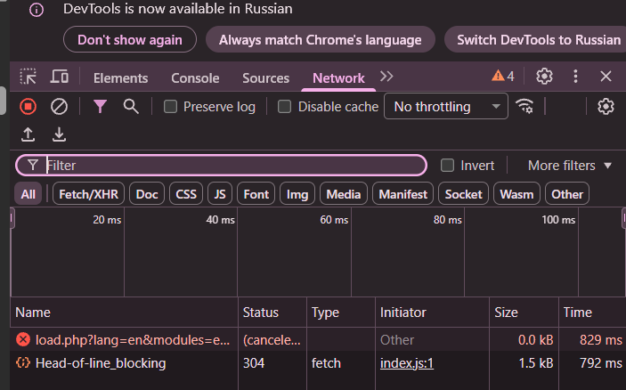
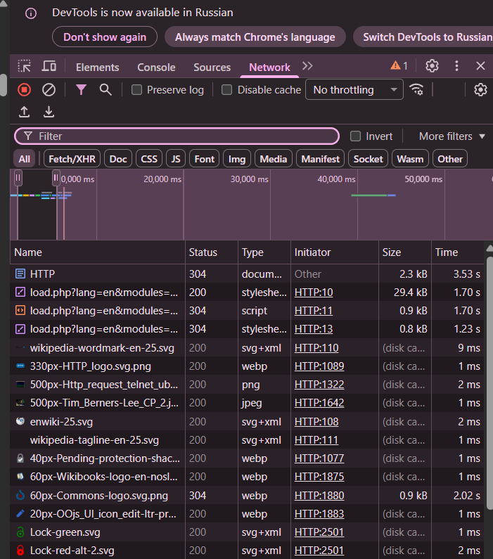
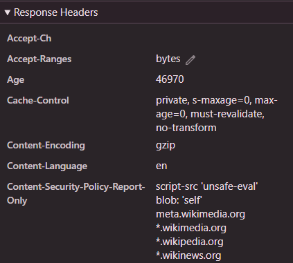
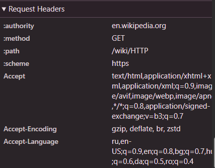

# Лабораторная работа №1. HTTP

## Цель работы

- Понять, что происходит, когда пользователь открывает сайт.
- Научиться находить и анализировать HTTP-запросы в браузере.
- Разобраться в назначении методов GET, POST, PUT, DELETE.

## Ход работы

### Шаг 1. Анализ HTTP-запросов. Часть 1

---

Перешел по ссылке, ведущей на статью про HTTP.

Зашел в инструменты разработчика.



Обновляю страницу.



Перейдя в HTTP-запрос, были узучены следующие аспекты:

1. **URL**: https://en.wikipedia.org/wiki/HTTP
2. Используется метод GET, так нужно получить содержимое ресурса. В данном случае это стать про HTTP.
3. Код состояния **304 Not Modified** означает, что запрашиваемый ресурс не изменился с момента последнего запроса, что позволяет сэкономить трафик и ускорить загрузку.
4. Заголовки запросов и ответов:
    1. Ответы

        - **Accept-Ch** — указывает, какие клиентские особенности (например, устройство, разрешение) сервер может использовать для адаптивной доставки контента.  
        - **Accept-Ranges** — сообщает клиенту, поддерживает ли сервер частичные запросы (например, `bytes` означает, что можно запрашивать диапазоны байтов).  
        - **Age** — показывает, сколько секунд прошло с момента, когда ответ был создан исходным сервером.  
        - **Cache-Control** — задаёт директивы для кэширования, управляя поведением кэшей на стороне клиента и промежуточных серверов.  
        - **Content-Encoding** — указывает метод кодирования тела ответа, применённый для сжатия перед передачей.  
        - **Content-Language** — объявляет язык содержимого ресурса, помогая клиенту выбрать подходящую локализацию.  
        - **Content-Security-Policy-Report-Only** — задаёт политику безопасности контента в режиме только отчётов (не блокирует нарушения, но отправляет отчёты).

    
 
    2. Запросы

        - **:authority** — псевдо-заголовок в HTTP/2 и HTTP/3, заменяющий `Host`, указывает домен целевого сервера (например, `en.wikipedia.org`).  
        - **:method** — псевдо-заголовок, определяющий HTTP-метод запроса.  
        - **:path** — псевдо-заголовок, содержащий путь и query-строку запрашиваемого ресурса.  
        - **:scheme** — псевдо-заголовок, указывающий протокол (обычно `https` или `http`).  
        - **Accept** — сообщает серверу, какие MIME-типы контента клиент готов принять (например, `text/html`, `image/png`, `*/*`), с указанием приоритетов через параметр `q`.
    
    

5. 
    - **Запрос**: тела нет, так как используется метод GET, что подразумевает что пользователь не отправляет в теле запроса.
    - **Ответ**: тело есть — это HTML-страница статьи из Википедии.

После перехода по ссылке https://en.wikipedia.org/wiki/HTTPdsfdfs, можно заметить, что код состояния **404 Not Found**.  
**404 Not Found** означает, что сервер не смог найти запрашиваемый ресурс по указанному URL, хотя сам сервер доступен и функционирует. 

### Шаг 2. Анализ HTTP-запросов. Часть 2

---

Перешел на https://en.wikipedia.org/wiki/Special:Search.

Выполнил поиск слова `browser`.

После перехода в `Network`, были проанализированы следуюие аспекты:

- **URL запроса**: https://en.wikipedia.org/w/index.php?search=browser&title=Special%3ASearch&profile=advanced&fulltext=1&ns0=1  
- **Метод запроса**: используется GET, потому что поиск не изменяет состояние сервера, параметры удобно передавать в URL. Также GET-запросы кэшируются и могут быть закладками/ссылками, что соответствует поведению поиска в браузере.  

- Передаются следующие параметры и их значение:
    | Параметр | Значение | Что означает и зачем используется |
    |---------|----------|-----------------------------------|
    | `search` | `browser` | Поисковой запрос — ключевое слово, по которому ищутся страницы. |
    | `title` | `Special%3ASearch` | Указывает, что запрос направлен на специальную страницу поиска (`Special:Search`) — это стандартный путь для поиска в MediaWiki. |
    | `profile` | `advanced` | Выбирает «расширенный» режим поиска (в отличие от `default` или `basic`). Может влиять на интерфейс и логику фильтрации. |
    | `fulltext` | `1` | Указывает, что поиск должен проводиться по **полному тексту статей**, а не только по заголовкам (`0` — поиск только по заголовкам). |
    | `ns0` | `1` | Включает пространство имён **0** (основное пространство имён — статьи), т.е. искать в обычных статьях. |  


### Шаг 3. Анализ HTTP-запросов. Часть 3. Google

---

**1. URL**  
`https://www.google.com/` — корневой адрес главной страницы Google.

**2. Метод**  
`GET` — используется для получения ресурса без изменения состояния сервера (стандартный метод для загрузки веб-страниц).

**3. Код состояния**  
Код состояния **200 OK** означает, что HTTP-запрос успешно выполнен и сервер вернул запрошенный клиентом ресурс в теле ответа.

**4. Заголовки запросов и ответов**

 **4.1. Запросы**  
- `:authority`: `www.google.com` — целевой хост.  
- `:method`: `GET` — HTTP-метод.  
- `:path`: `/` — путь запроса.  
- `:scheme`: `https` — протокол.  
- `Accept`: перечисление поддерживаемых MIME-типов (HTML, XML, images, WebP, AVIF и др.) с приоритетами (`q=0.9`, `q=0.8`, `q=0.7`).  
- `Accept-Encoding`: `gzip, deflate, br, zstd, dcb, dcx` — поддерживаемые методы сжатия.  
- `Accept-Language`: `ru,en` — предпочтительные языки интерфейса (русский, затем английский).  
- `Accept-Ch`: `Sec-CH-Prefers-Color-Scheme`, `Downlink`, `RTT` — клиентские подсказки (темная тема, скорость соединения, задержка).

 **4.2. Ответы**  
- `Content-Type`: `text/html; charset=UTF-8` — тип содержимого и кодировка.  
- `Cross-Origin-Opener-Policy`: `same-origin-allow-popups; report-to="gws"` — политика безопасности для окон/всплывающих окон.  
- `Date`: `Fri, 13 Feb 2026 16:10:20 GMT` — время генерации ответа.  
- `Expires`: `-1` — указывает, что ресурс устаревает немедленно (требует повторной проверки).  
- `Permissions-Policy`: `unload=0` — запрещает выполнение `window.unload` (ограничение API).

**5. Query Parameters**  
В данном запросе **query-параметры** отсутствуют, так как путь — просто `/`, и никаких `?key=value` в URL нет.


### Шаг 4. Составление HTTP-запросов

---

1. GET-запрос с User-Agent

```http
GET / HTTP/1.1
Host: sandbox.usm.com
User-Agent: Ivan Ivanov
```

**Что такое User-Agent и для чего он используется?**  
User-Agent — это строка в заголовке HTTP-запроса, которая идентифицирует клиент (браузер, скрипт, устройство), его версию и операционную систему. Сервер использует её для адаптации контента, сбора аналитики, отладки или блокировки устаревших клиентов.

2. POST-запрос к `/cars`

```http
POST /cars HTTP/1.1
Host: sandbox.usm.com
Content-Type: application/x-www-form-urlencoded
Content-Length: 45

make=Toyota&model=Corolla&year=2020
```

**К другим методам HTTP относятся:**  
- **GET** — получение ресурса.  
- **POST** — создание нового ресурса или отправка данных.  
- **PUT** — полная замена ресурса по указанному URI.  
- **PATCH** — частичное обновление ресурса.  
- **DELETE** — удаление ресурса.  
- **HEAD** — как GET, но без тела ответа (только заголовки).  
- **OPTIONS** — запрос поддерживаемых методов для ресурса.  

3. PUT-запрос к `/cars/1`

```http
PUT /cars/1 HTTP/1.1
Host: sandbox.usm.com
User-Agent: Ivan Ivanov
Content-Type: application/json
Content-Length: 62

{"make":"Toyota","model":"Corolla","year":2021}
```

**В чём разница между PATCH и PUT?**  
PUT заменяет **весь ресурс** целиком — даже если в теле указаны не все поля, остальные могут быть удалены или сброшены. PATCH применяет **частичное обновление** — изменяются только указанные поля, остальные остаются без изменений.

4. Возможный ответ сервера на POST-запрос

Запрос:
```http
POST /cars HTTP/1.1
Host: sandbox.com
Content-Type: application/json
User-Agent: John Doe
model=Corolla&make=Toyota&year=2020
```

**Пример ответа сервера:**
```http
HTTP/1.1 201 Created
Content-Type: application/json
Location: /cars/5

{"id":5,"make":"Toyota","model":"Corolla","year":2020}
```

5. Когда сервер может вернуть следующие коды:

- **200 OK** — если POST используется не для создания, а для обработки (редко, но возможно); чаще 200 возвращается при PUT/PATCH.  
- **201 Created** — когда новый автомобиль успешно создан, и сервер присваивает ему ID.  
- **400 Bad Request** — если тело запроса некорректно (например, несовпадение Content-Type и формата данных, неверный год, отсутствует обязательное поле).  
- **401 Unauthorized** — если сервер требует аутентификации (например, токен), а запрос отправлен без неё.  
- **403 Forbidden** — если пользователь аутентифицирован, но не имеет прав на создание записей.  
- **404 Not Found** — если эндпоинт `/cars` не существует.  
- **500 Internal Server Error** — если произошла ошибка на стороне сервера (например, база данных недоступна, исключение в коде).


## Библиография

- https://en.wikipedia.org/wiki/HTTP
- https://elearning.usm.md/mod/assign/view.php?id=300532