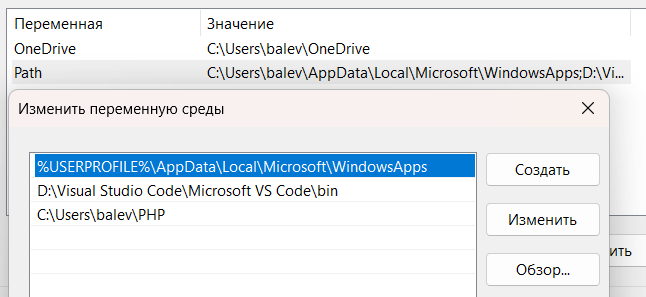
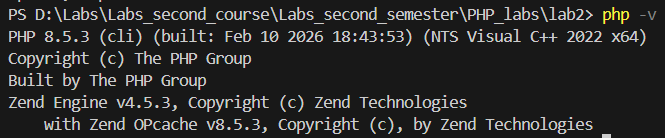
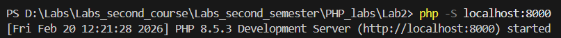
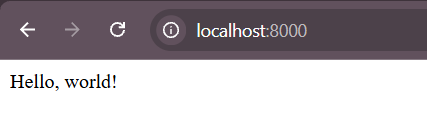
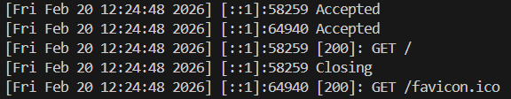
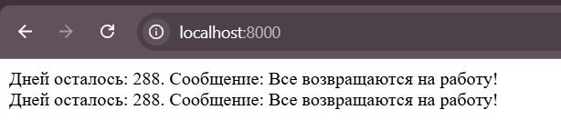

# Лабораторная работа №2. Установка и первая программа на PHP

## Цель работы

Целью данной лабораторной работы является установка и настройка среды разработки для работы с языком программирования PHP, а также создание первой программы на PHP.

## Ход работы

### 1. Установка PHP

Для выполнения данной лабораторной работы, для начала нужно установить PHP с официального сайта.  
После установки нужно было добавить PHP в переменные среды.

Далее нужно было убедиться, что PHP установлен.

### 2. Альтернативный способ установки PHP

Пропущен, так как PHP уже был установлен ранее.

### 3. Написание первой PHP-программы

Создан файл `index.php`, а после запущен с помощью встроенного веб-сервера PHP.  
Сперва был запущен веб-сервер.

Затем требуется ввести адрес веб-сервера в адресную строку браузера.

Консоль отображает логи веб-сервера: время запроса, внутренний идентификатор процесса, код состояния HTTP (например, 200 — успех) и путь к запрошенному ресурсу, подтверждая успешную обработку запросов браузера.

### 4. Вывод данных в PHP

### 5. Работа с переменными и выводом

Созданы две переменные:  
-  Целочисленная переменная `$days` со значением `288`.
- Строковая переменная `$message` с текстом: `Все возвращаются на работу!`.

Эти переменные выведены двумя способами:  
- С использованием конкатенации.
- С использованием двойных кавычек.

Был использован тег ` `, чтобы принудительно перенести текст на новую строку внутри текущего блока, не создавая новый абзац.

## Контрольные вопросы

1. **Какие способы установки PHP существуют?**  
2. **Как проверить, что PHP установлен и работает?**  
3. **Чем отличается оператор echo от print?**  

***

1. Есть два способа установки:  
	- установка PHP с официального сайта;
	- установить XAMPP и настроить эту среду.
2.  Необходимо написать в консоль команду `php -v`. Эта команда выведет номер текущей версии PHP, дату сборки, информацию о используемом движке Zend и список загруженных модулей расширений.  
3. `echo` работает быстрее, поддерживает вывод нескольких аргументов через запятую и ничего не возвращает. `print` принимает только один аргумент, работает медленнее и всегда возвращает значение 1, что позволяет использовать его в сложных выражениях.  