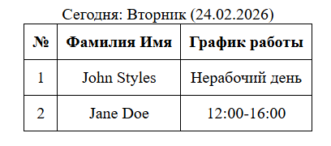
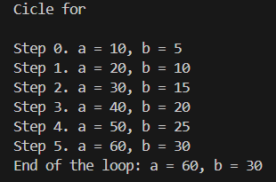
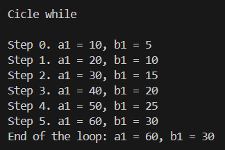
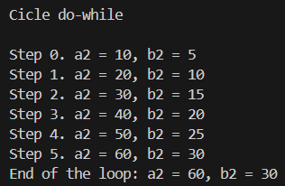

# Лабораторная работа №3. Управляющие конструкции

## Цель работы

Изучить конструкции и циклы в языке PHP.

## Ход работы

### Условные конструкции

**1. Получение даты**  
Использована встроенная функция date('N'). Она возвращает числовое представление дня недели (1 для понедельника, 7 для воскресенья), что упрощает сравнение.

```php
$dayOfWeek = date('N'); 
```

**2. Логика расписания**  
Созданы две отдельные функции для каждого сотрудника. Внутри них проверка дней недели выполнена через условный оператор if и логическое ИЛИ (||).

```php
function getJohnStylesSchedule($day) {
    if ($day == 1 || $day == 3 || $day == 5) {
        return '8:00-12:00';
    } else {
        return 'Нерабочий день';
    }
}


function getJaneDoeSchedule($day) {
    if ($day == 2 || $day == 4 || $day == 6) {
        return '12:00-16:00';
    } else {
        return 'Нерабочий день';
    }
}
```

**3. Вывод данных**  
PHP-код встроен прямо в HTML-разметку. Значения переменных выводятся в ячейки таблицы с помощью конструкции echo. Это позволяет генерировать статическую страницу динамически в момент запроса.

```html
<div class="current-day">
    Сегодня: <?php 
    $days = ['Воскресенье', 'Понедельник', 'Вторник', 'Среда', 'Четверг', 'Пятница', 'Суббота'];
    echo $days[date('w')] . ' (' . date('d.m.Y') . ')';
    ?>
</div>

<table>
    <thead>
        <tr>
            <th>№</th>
            <th>Фамилия Имя</th>
            <th>График работы</th>
        </tr>
    </thead>
    <tbody>
        <tr>
            <td>1</td>
            <td>John Styles</td>
            <td><?php echo $johnSchedule; ?></td>
        </tr>
        <tr>
            <td>2</td>
            <td>Jane Doe</td>
            <td><?php echo $janeSchedule; ?></td>
        </tr>
    </tbody>
</table>
```

**4. Результат работы кода**



### Циклы

Далее нужно было реализовать логику цикла `for`, таким образом, чтобы выводились промежуточные значения. Затем проделать то же самое для циклов `while` и `do-while`.

#### Цикл `for`

```php
echo "Cicle for\n\n";

$a = 0;
$b = 0;

for ($i = 0; $i <= 5; $i++) {
   $a += 10;
   $b += 5;
   echo "Step $i. a = $a, b = $b\n";

}

echo "End of the loop: a = $a, b = $b\n";
echo "\n";
```



#### Цикл `while`

```php
echo "Cicle while\n\n";

$a1 = 0;
$b1 = 0;
$i = 0;

while ($i <= 5) {
   $a1 += 10;
   $b1 += 5;
   echo "Step $i. a1 = $a1, b1 = $b1\n";
   $i++;
}

echo "End of the loop: a1 = $a1, b1 = $b1\n";
echo "\n";
```



#### Цикл `do-while`

```php
echo "Cicle do-while\n\n";

$a2 = 0;
$b2 = 0;
$i = 0;

do {
   $a2 += 10;
   $b2 += 5;
   echo "Step $i. a2 = $a2, b2 = $b2\n";
   $i++;
} while ($i <= 5);

echo "End of the loop: a2 = $a2, b2 = $b2\n";
```



## Контрольные вопросы

**1. В чем разница между циклами for, while и do-while? В каких случаях лучше использовать каждый из них?**

**Цикл for**  
Все параметры управления (инициализация счетчика, условие продолжения и изменение счетчика) записаны в одной строке заголовка, что делает структуру компактной и предсказуемой.  
Когда использовать: Лучше всего подходит для ситуаций, когда заранее известно точное количество повторений или когда нужно перебирать элементы массива по индексам.

**Цикл do-while**  
Условие проверяется после выполнения тела цикла, что гарантирует выполнение кода внутри как минимум один раз, независимо от истинности условия.  
Следует применять, когда логика задачи требует обязательного однократного выполнения действий перед первой проверкой условия (например, вывод меню пользователю перед запросом выбора).

**Цикл while**  
Условие проверяется перед выполнением тела цикла, поэтому если условие ложно сразу же, код внутри цикла не выполнится ни разу.  
Идеален для случаев, когда количество итераций неизвестно заранее и зависит от изменения данных в процессе работы (например, чтение файла до конца или ожидание ввода пользователя).

**2. Как работает тернарный оператор `? :` в PHP?**

Тернарный оператор ? : в PHP вычисляет условие перед знаком вопроса: если оно истинно, возвращается значение слева от двоеточия, а если ложно — значение справа. Синтаксически это выглядит как `(условие) ? значение_если_истина : значение_если_ложь`. Эта конструкция служит компактной заменой полной версии условия `if-else` при присваивании переменных или возврате значений из функций.

**3. Что произойдет, если в do-while поставить условие, которое изначально ложно?**

Поскольку цикл `do-while` сначала выполняет тело цикла, а затем проверяет условие, код внутри него выполнится ровно один раз, даже если условие изначально ложно. Проверка истинности происходит только после первого прохода, поэтому цикл гарантированно отработает минимум одну итерацию перед завершением.