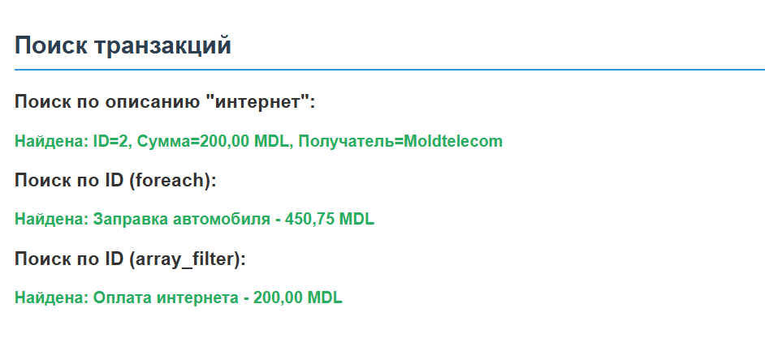
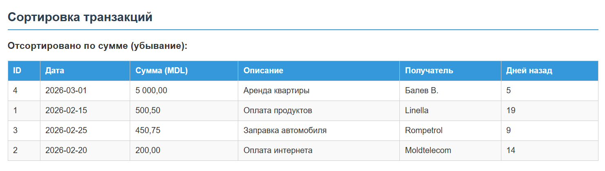
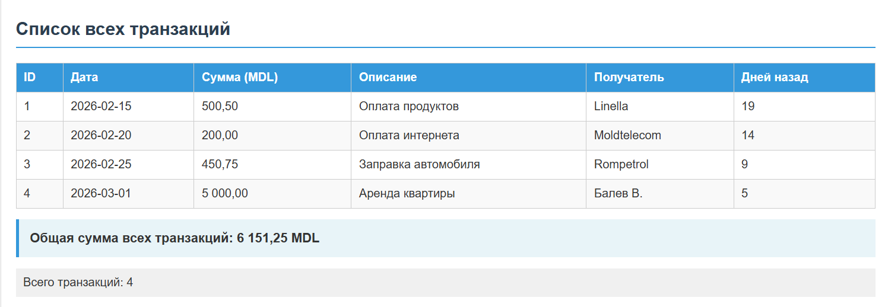
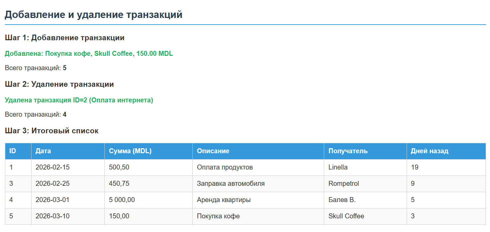

# Лабораторная работа №4. Управляющие конструкции

# Лабораторная работа. Система управления банковскими транзакциями

## Цель работы
Изучить работу с массивами, функциями, циклами и файловой системой в языке PHP. Реализовать систему управления транзакциями с возможностью добавления, удаления, сортировки и поиска данных, а также создать галерею изображений.

## Ход работы

### Часть 1. Управление транзакциями

#### 1. Подготовка среды и создание массива
В начале файла `index.php` подключена строгая типизация с помощью директивы `declare(strict_types=1);`. Создан массив `$transactions`, представляющий собой многомерный ассоциативный массив. Каждая запись содержит поля: `id`, `date`, `amount`, `description`, `merchant`.

```php
<?php
declare(strict_types=1);

$transactions = [
    [
        'id' => 1,
        'date' => '2026-02-15',
        'amount' => 1500.50,
        'description' => 'Оплата продуктов',
        'merchant' => 'Linella'
    ],
    [
        'id' => 2,
        'date' => '2026-02-20',
        'amount' => 200.00,
        'description' => 'Оплата интернета',
        'merchant' => 'Moldtelecom'
    ],
    [
        'id' => 3,
        'date' => '2026-02-25',
        'amount' => 450.75,
        'description' => 'Заправка автомобиля',
        'merchant' => 'Rompetrol'
    ],
    [
        'id' => 4,
        'date' => '2026-03-01',
        'amount' => 5000.00,
        'description' => 'Аренда квартиры',
        'merchant' => 'Балев В.'
    ]
];
```

#### 2. Реализация функций обработки данных
Для работы с массивом реализован набор функций, каждая из которых отвечает за единственную задачу (принцип SRP).

*   **`calculateTotalAmount`**: Проходит циклом `foreach` по массиву и суммирует поле `amount`.
*   **`findTransactionByDescription`**: Использует функцию `stripos` для регистронезависимого поиска подстроки в описании.
*   **`findTransactionById`**: Реализована в двух вариантах. Первый использует цикл `foreach` для последовательного перебора. Второй вариант использует функцию высшего порядка `array_filter`, которая возвращает отфильтрованный массив, из которого затем берется первый элемент.
*   **`daysSinceTransaction`**: Использует класс `DateTime` для вычисления разницы между текущей датой и датой транзакции. Метод `diff` возвращает объект интервала, из которого извлекается количество дней.
*   **`addTransaction`**: Принимает параметры новой записи и добавляет ассоциативный массив в глобальный массив `$transactions` с использованием ключевого слова `global`.
*   **`deleteTransaction`**: Находит элемент по ID, удаляет его через `unset` и переиндексирует массив функцией `array_values`.

```php
function findTransactionByIdFilter(int $id): ?array {
    global $transactions;
    $filtered = array_filter(
        $transactions,
        function ($transaction) use ($id) {
            return $transaction['id'] === $id;
        }
    );
    return !empty($filtered) ? array_shift($filtered) : null;
}

function daysSinceTransaction(string $date): int {
    $transactionDate = new DateTime($date);
    $currentDate = new DateTime();
    $interval = $currentDate->diff($transactionDate);
    return (int)$interval->days;
}
```


#### 3. Сортировка транзакций
Для сортировки использована функция `usort`, принимающая массив по ссылке и анонимную функцию сравнения.
*   Сортировка по дате выполнена с приведением строк к объектам `DateTime`.
*   Сортировка по сумме выполнена в порядке убывания путем сравнения значений `$b['amount'] <=> $a['amount']`.

```php
function sortTransactionsByAmount(array &$transactions): void {
    usort($transactions, function ($a, $b) {
        return $b['amount'] <=> $a['amount'];
    });
}
```



#### 4. Вывод данных в HTML
Сформирована HTML-таблица с использованием цикла `foreach`. В таблицу добавлен столбец «Дней назад», значение для которого вычисляется динамически. Общая сумма транзакций выводится отдельным блоком после таблицы.



#### 5. Демонстрация добавления и удаления
В ходе выполнения скрипта продемонстрирована работа функций модификации данных:
1.  Добавлена новая транзакция (покупка кофе).
2.  Выведено обновленное количество записей.
3.  Выполнено удаление транзакции по идентификатору.
4.  Выведено итоговое количество записей и обновленный список.



### Часть 2. Работа с файловой системой (Галерея)

Реализована веб-страница со стандартной структурой: хедер, навигационное меню, основной контент и футер. Стили вынесены в отдельный файл `style.css`.

Для вывода изображений создана функция `getImagesFromDirectory`, использующая `glob` для поиска файлов с расширениями `.jpg` и `.jpeg` в папке `image`. Функция `generateImageGallery` генерирует сетку изображений. Если директория пуста или не найдена, выводится соответствующее уведомление.

```php
function getImagesFromDirectory(string $directory): array {
    $images = [];
    $jpgFiles = glob($directory . '/*.jpg');
    $jpegFiles = glob($directory . '/*.jpeg');
    if ($jpgFiles !== false) $images = array_merge($images, $jpgFiles);
    if ($jpegFiles !== false) $images = array_merge($images, $jpegFiles);
    return $images;
}
```

Результат работы галереи отображается в нижней части страницы.


## Контрольные вопросы

**1. Что такое массивы в PHP?**  
Массив в PHP - это упорядоченная структура данных, позволяющая хранить множество значений в одной переменной. Элементы массива могут быть любого типа, включая другие массивы, и доступ к ним осуществляется по числовым индексам или строковым ключам.

**2. Каким образом можно создать массив в PHP?**  
Массив можно создать с помощью короткого синтаксиса в квадратных скобках `[]`, устаревшей конструкции `array()`, либо путем постепенного добавления элементов присваиванием значений по индексам. Также возможно создание массива из переменных с помощью функции `compact`.

**3. Для чего используется цикл foreach?**  
Цикл `foreach` предназначен для удобного перебора элементов массива без необходимости использования счетчика. Он автоматически проходит по всем элементам, предоставляя доступ к текущему значению и, при необходимости, к его ключу, что делает код более читаемым и безопасным.

