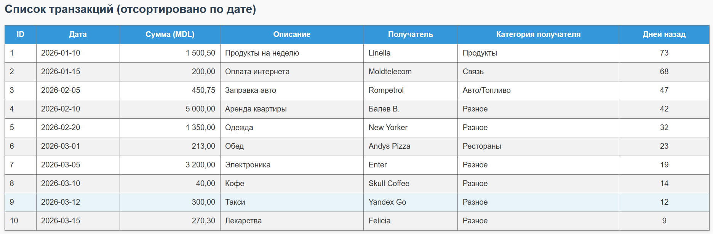
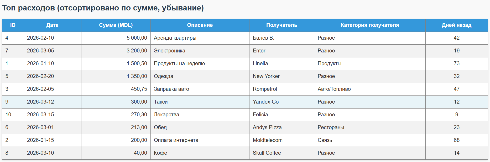
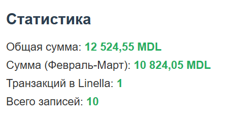
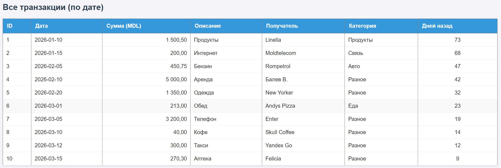
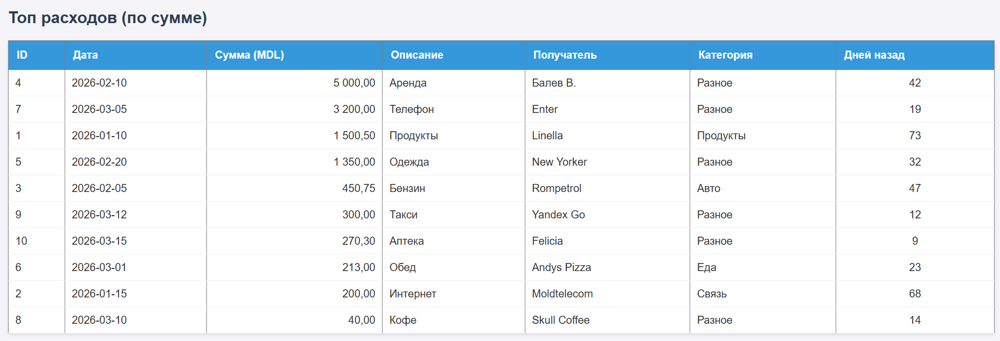

# Лабораторная работа №5. Объектно-ориентированное программирование в PHP

## Цель работы

Освоить основы объектно-ориентированного программирования в PHP на практике. Научиться создавать собственные классы, использовать инкапсуляцию для защиты данных, разделять ответственность между классами, а также применять интерфейсы для построения гибкой архитектуры приложения.

## Ход работы

### Часть 1. Реализация архитектуры ООП

#### 1. Подготовка среды и строгая типизация
В начале файла `index.php` подключена строгая типизация с помощью директивы `declare(strict_types=1);`. Это гарантирует контроль типов аргументов и возвращаемых значений на уровне языка, предотвращая неявные преобразования, что критически важно для финансовых расчетов.

```php
<?php
declare(strict_types=1);
```

#### 2. Класс Transaction (Модель данных)
Создан класс `Transaction`, описывающий одну банковскую транзакцию.
*   **Инкапсуляция:** Все свойства (`id`, `date`, `amount`, `description`, `merchant`) объявлены как `private`. Доступ к ним возможен только через публичные getter-методы.
*   **Конструктор:** Инициализация свойств происходит строго при создании объекта.
*   **Бизнес-логика:** Метод `getDaysSinceTransaction()` использует класс `DateTime` для вычисления количества дней, прошедших с момента транзакции.

```php
class Transaction
{
    private int $id;
    private string $date;
    private float $amount;
    private string $description;
    private string $merchant;

    public function __construct(int $id, string $date, float $amount, string $description, string $merchant) {
        $this->id = $id;
        $this->date = $date;
        $this->amount = $amount;
        $this->description = $description;
        $this->merchant = $merchant;
    }

    public function getDaysSinceTransaction(): int {
        $transactionDate = new DateTime($this->date);
        $currentDate = new DateTime();
        return (int)$currentDate->diff($transactionDate)->days;
    }
    
    // Геттеры для доступа к приватным свойствам...
    public function getAmount(): float { return $this->amount; }
    public function getId(): int { return $this->id; }
    // ... остальные геттеры
}
```

#### 3. Класс TransactionRepository (Хранилище)
Класс `TransactionRepository` отвечает исключительно за хранение коллекции объектов и базовые операции доступа к ним (CRUD).
*   **Сокрытие данных:** Массив транзакций является приватным свойством `$transactions`. Прямой доступ извне запрещен.
*   **Методы:** Реализованы методы `addTransaction()`, `removeTransactionById()`, `getAllTransactions()` и `findById()`.
*   При удалении элемента используется `unset()` с последующей переиндексацией массива через `array_values()`, чтобы сохранить непрерывность числовых ключей.

```php
class TransactionRepository
{
    private array $transactions = [];

    public function addTransaction(Transaction $transaction): void {
        $this->transactions[] = $transaction;
    }

    public function removeTransactionById(int $id): void {
        foreach ($this->transactions as $key => $transaction) {
            if ($transaction->getId() === $id) {
                unset($this->transactions[$key]);
                $this->transactions = array_values($this->transactions);
                return;
            }
        }
    }
    
    public function getAllTransactions(): array {
        return $this->transactions;
    }
    
    public function findById(int $id): ?Transaction {
        foreach ($this->transactions as $transaction) {
            if ($transaction->getId() === $id) return $transaction;
        }
        return null;
    }
}
```

#### 4. Класс TransactionManager (Бизнес-логика)
Класс `TransactionManager` реализует основную логику приложения, не храня данные самостоятельно.
*   **Внедрение зависимостей (Dependency Injection):** Объект `TransactionRepository` передается в конструктор менеджера. Это позволяет разделить ответственность: менеджер знает *что* делать с данными, а репозиторий — *как* их хранить.
*   **Реализованные методы:**
    *   `calculateTotalAmount()`: Суммирование всех транзакций.
    *   `calculateTotalAmountByDateRange()`: Фильтрация по датам и суммирование.
    *   `countTransactionsByMerchant()`: Подсчет операций по получателю.
    *   `sortTransactionsByDate()` и `sortTransactionsByAmountDesc()`: Сортировка коллекций с использованием `usort` и оператора `<=>` (spaceship operator).

```php
class TransactionManager
{
    private TransactionRepository $repository;

    public function __construct(TransactionRepository $repository) {
        $this->repository = $repository;
    }

    public function calculateTotalAmount(): float {
        $total = 0.0;
        foreach ($this->repository->getAllTransactions() as $t) {
            $total += $t->getAmount();
        }
        return $total;
    }

    public function sortTransactionsByAmountDesc(): array {
        $transactions = $this->repository->getAllTransactions();
        usort($transactions, fn($a, $b) => $b->getAmount() <=> $a->getAmount());
        return $transactions;
    }
    // ... другие методы бизнес-логики
}
```

#### 5. Класс TransactionTableRenderer (Представление)
Класс `TransactionTableRenderer` отвечает только за генерацию HTML-кода.
*   **Принцип единственной ответственности:** Логика отображения полностью отделена от логики данных и бизнеса.
*   Метод `render(array $transactions): string` принимает массив объектов, проходит по нему циклом `foreach`, вызывает геттеры объектов для получения данных и формирует HTML-таблицу.
*   Реализован вспомогательный приватный метод `getMerchantCategory()` для автоматического определения категории получателя на основе названия магазина.

```php
final class TransactionTableRenderer
{
    public function render(array $transactions): string {
        $html = "<table>...</table>"; // Формирование структуры таблицы
        foreach ($transactions as $t) {
            // Использование геттеров и htmlspecialchars для безопасности
            $html .= "<tr><td>{$t->getId()}</td><td>{$t->getAmount()}</td>...</tr>";
        }
        return $html;
    }
    
    private function getMerchantCategory(string $merchant): string {
        // Логика категоризации
        if (str_contains(strtolower($merchant), 'linella')) return 'Продукты';
        return 'Разное';
    }
}
```

#### 6. Инициализация и вывод данных
В основном блоке скрипта выполнена сборка приложения:
1.  Созданы экземпляры классов: `$repository`, `$manager`, `$renderer`.
2.  Сгенерировано 10 объектов `Transaction` с разнообразными данными (разные даты, суммы, мерчанты).
3.  Объекты добавлены в репозиторий через цикл.
4.  Через менеджер выполнены расчеты (общая сумма, суммы по периодам).
5.  Данные отсортированы и переданы в рендерер для вывода на страницу.

На странице отображаются:
*   Блок статистики с рассчитанными значениями.
*   Таблица всех транзакций, отсортированная по дате.
*   Таблица топ-расходов, отсортированная по сумме (убывание).

**Результат работы программы:**

**Блок статистики:**  


**Таблица всех транзакций, отсортированная по дате:**  


**Таблица расходов, отсортированная по убыванию суммы:**  


#### 7. Внедрение интерфейса TransactionStorageInterface (Рефакторинг архитектуры)

На финальном этапе работы архитектура приложения была улучшена за счет внедрения интерфейса `TransactionStorageInterface`. Это позволило реализовать **Принцип инверсии зависимостей (Dependency Inversion Principle — буква "D" из SOLID)**, согласно которому модули верхнего уровня не должны зависеть от модулей нижнего уровня; оба должны зависеть от абстракций.

**Создание интерфейса**
Был объявлен интерфейс `TransactionStorageInterface`, который определяет контракт (набор методов), обязательный для реализации любым классом-хранилищем:
*   `addTransaction(Transaction $transaction): void`
*   `removeTransactionById(int $id): void`
*   `getAllTransactions(): array`
*   `findById(int $id): ?Transaction`

```php
/**
 * Интерфейс определяет контракт для хранилищ транзакций.
 * Позволяет абстрагироваться от конкретной реализации хранения данных.
 */
interface TransactionStorageInterface
{
    public function addTransaction(Transaction $transaction): void;
    public function removeTransactionById(int $id): void;
    public function getAllTransactions(): array;
    public function findById(int $id): ?Transaction;
}
```

**Реализация в классе Repository**
Класс `TransactionRepository` был изменен таким образом, чтобы явно реализовывать данный интерфейс с помощью ключевого слова `implements`. Это гарантирует, что класс предоставляет все методы, описанные в контракте.

```php
class TransactionRepository implements TransactionStorageInterface
{
    // ... реализация методов остается прежней
}
```

**Изменение зависимости в Manager**
Наиболее важное изменение произошло в классе `TransactionManager`. Ранее он зависел от конкретного класса `TransactionRepository`. Теперь в конструкторе используется типизация интерфейсом `TransactionStorageInterface`.

*Было:*
```php
public function __construct(TransactionRepository $repository) { ... }
```

*Стало:*
```php
public function __construct(TransactionStorageInterface $repository) {
    $this->repository = $repository;
}
```

Вот переработанный вариант раздела «Результат рефакторинга», написанный в стиле академического отчета, с опорой на терминологию из ваших лекций (SOLID, функции, типы):

#### Результат внедрения интерфейса

Применение интерфейса `TransactionStorageInterface` позволило достичь следующих архитектурных преимуществ:

1.  **Повышение гибкости системы**
    Класс `TransactionManager` теперь зависит не от конкретной реализации (`TransactionRepository`), а от абстракции. Это позволяет легко заменять способ хранения данных (например, переключиться с массива в памяти на базу данных MySQL или JSON-файл), создавая новые классы, реализующие интерфейс, без необходимости изменения кода бизнес-логики.

2.  **Упрощение тестирования**
    Наличие общего контракта позволяет использовать внедрение зависимостей для подмены реального хранилища на тестовые заглушки (mock-объекты). Это дает возможность проверять работу методов `TransactionManager` изолированно, без подключения реальной базы данных или работы с файловой системой.

**Блок статистики:**  


**Таблица всех транзакций, отсортированная по дате:**  


**Таблица расходов, отсортированная по убыванию суммы:**  


#### Контрольные вопросы

**1. Зачем нужна строгая типизация в PHP и как она помогает при разработке?**  
Строгая типизация запрещает неявное приведение типов аргументов функций и возвращаемых значений. Она помогает избежать скрытых ошибок, когда PHP автоматически преобразует данные, что критически важно для финансовых расчетов. При несоответствии типов скрипт завершается с понятной ошибкой `TypeError`, а не выдает неверный результат.

**2. Что такое класс в объектно-ориентированном программировании и какие основные компоненты класса вы знаете?**  
Класс — это шаблон (чертеж) для создания объектов, который инкапсулирует данные и поведение в единую сущность. Основные компоненты класса:
*   **Свойства (поля):** переменные для хранения состояния объекта (в нашей работе они объявлены как `private` для защиты данных).
*   **Методы:** функции, определяющие поведение объекта и работающие с его свойствами.
*   **Конструктор (`__construct`):** специальный метод, вызываемый автоматически при создании объекта для его первоначальной инициализации.

**3. Объясните, что такое полиморфизм и как он может быть реализован в PHP.**  
Полиморфизм — Полиморфизм — это способность одного и того же кода работать с объектами разных классов через общий интерфейс или базовый класс. Например, в данной работе это проявляется в том, что класс `TransactionManager` может работать с любым классом-хранилищем, пока тот реализует интерфейс `TransactionStorageInterface`.

**4. Что такое интерфейс в PHP и как он отличается от абстрактного класса?**  
Интерфейс — это контракт, который объявляет список методов, которые обязан реализовать любой подключивший его класс, но не содержит их реализации (тела методов). Главное отличие от абстрактного класса: интерфейс не может содержать свойств и реализованной логики, а класс может реализовывать сразу несколько интерфейсов, тогда как наследовать можно только один абстрактный класс.

**5. Какие преимущества дает использование интерфейсов при проектировании архитектуры приложения? Объясните на примере данной лабораторной работы.**  
Использование интерфейсов обеспечивает слабую связность кода и гибкость архитектуры. В данной работе класс `TransactionManager` зависит не от конкретного класса `TransactionRepository`, а от абстракции `TransactionStorageInterface`. Это позволяет в будущем заменить способ хранения данных, создав новый класс с тем же интерфейсом, без необходимости изменять ни одной строчки кода в бизнес-логике менеджера.