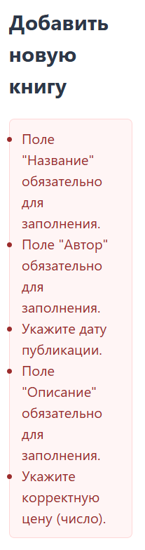
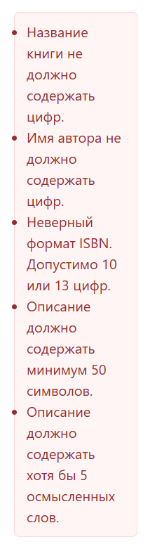
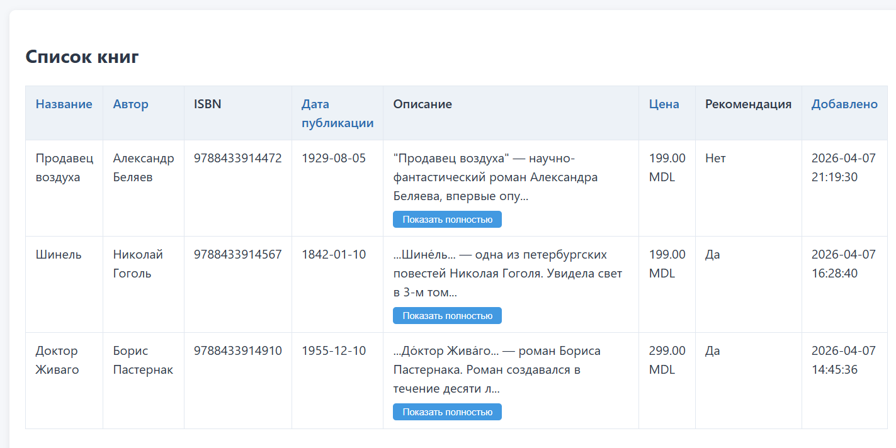

# Лабораторная работа №6. Обработка и валидация форм

## Цель работы
Освоить принципы работы с HTML-формами в PHP, реализовать серверную валидацию данных, изучить хранение данных в файлах (JSON) и применить объектно-ориентированный подход (ООП) для организации кода.

## Тема работы

Система управления книгами в книжном магазине.

## Ход работы

### Шаг 1. Определение модели данных
В качестве темы проекта выбран "Книжный магазин". Определена структура данных для книги, удовлетворяющая требованиям лаборатории:

*   **title** (string) - название книги;
*   **author** (string) - автор;
*   **isbn** (string) - международный стандартный книжный номер;
*   **publication_date** (date) - дата публикации;
*   **description** (text) - описание;
*   **price** (float) - стоимость;
*   **is_featured** (boolean/checkbox) - признак "рекомендуемое издание" (реализация enum);
*   **created_at** (date/time) - дата добавления в систему.

Для представления данных создан класс `Book`, инкапсулирующий свойства и метод преобразования объекта в массив. Класс использует типизированные свойства и конструктор, который принимает ассоциативный массив данных из формы, применяет фильтрацию через `trim()` и приведение типов. Метод `toArray()` возвращает объект в виде массива для последующей сериализации в JSON.

```php
class Book {
    public string $title;
    public string $author;
    public string $isbn;
    public string $publication_date;
    public string $description;
    public float $price;
    public bool $is_featured;
    public string $created_at;

    public function __construct(array $data) {
        $this->title = trim($data['title'] ?? '');
        $this->author = trim($data['author'] ?? '');
        $this->isbn = trim($data['isbn'] ?? '');
        $this->publication_date = $data['publication_date'] ?? date('Y-m-d');
        $this->description = trim($data['description'] ?? '');
        $this->price = isset($data['price']) ? (float)$data['price'] : 0.0;
        $this->is_featured = isset($data['is_featured']);
        $this->created_at = $data['created_at'] ?? date('Y-m-d H:i:s');
    }

    public function toArray(): array {
        return [
            'title' => $this->title,
            'author' => $this->author,
            'isbn' => $this->isbn,
            'publication_date' => $this->publication_date,
            'description' => $this->description,
            'price' => $this->price,
            'is_featured' => $this->is_featured,
            'created_at' => $this->created_at
        ];
    }
}
```

### Шаг 2. Создание HTML-формы
Разработана форма добавления новой книги с использованием семантической разметки. Форма отправляет данные методом `POST` на тот же скрипт (`index.php`), что упрощает обработку. Для каждого поля заданы соответствующие типы HTML5: `text` для строковых данных, `date` для даты, `number` с атрибутом `step="0.01"` для цены. Атрибуты `required`, `minlength`, `maxlength` и `pattern` обеспечивают базовую валидацию на стороне клиента, улучшая пользовательский опыт и снижая нагрузку на сервер.

Поле "Рекомендуемое издание" реализовано через `checkbox`, что соответствует требованию о наличии поля с ограниченным набором значений (enum). Значение поля обрабатывается через проверку `isset($_POST['is_featured'])`, так как неотмеченные чекбоксы не передаются в запросе.

```html
<form method="POST" action="index.php" novalidate>
    <div class="form-group">
        <label for="title">Название книги *</label>
        <input type="text" id="title" name="title" required minlength="2" maxlength="150" 
               value="<?= htmlspecialchars($_POST['title'] ?? '') ?>">
    </div>
    
    <div class="form-group">
        <label for="author">Автор *</label>
        <input type="text" id="author" name="author" required minlength="2" maxlength="100"
               value="<?= htmlspecialchars($_POST['author'] ?? '') ?>">
    </div>
    
    <div class="form-group">
        <label for="isbn">ISBN *</label>
        <input type="text" id="isbn" name="isbn" required 
               pattern="^(97(8|9))?\d{9}(\d|X)?$" maxlength="13"
               value="<?= htmlspecialchars($_POST['isbn'] ?? '') ?>">
    </div>
    
    <div class="form-group">
        <label for="publication_date">Дата публикации *</label>
        <input type="date" id="publication_date" name="publication_date" required
               value="<?= htmlspecialchars($_POST['publication_date'] ?? '') ?>">
    </div>
    
    <div class="form-group">
        <label for="description">Описание (аннотация) *</label>
        <textarea id="description" name="description" required minlength="50" maxlength="2000">
            <?= htmlspecialchars($_POST['description'] ?? '') ?>
        </textarea>
    </div>
    
    <div class="form-group">
        <label for="price">Цена (руб.) *</label>
        <input type="number" id="price" name="price" required step="0.01" min="0"
               value="<?= htmlspecialchars($_POST['price'] ?? '') ?>">
    </div>
    
    <div class="form-group checkbox-group">
        <input type="checkbox" id="is_featured" name="is_featured" value="1"
               <?= isset($_POST['is_featured']) ? 'checked' : '' ?>>
        <label for="is_featured">Рекомендуемое издание</label>
    </div>
    
    <button type="submit">Сохранить книгу</button>
</form>
```

### Шаг 3. Реализация ООП и валидации
Логика работы разделена на три класса для соблюдения принципа единственной ответственности (SRP):

1.  **BookValidator** - отвечает за проверку входных данных и возврат массива ошибок.
2.  **BookRepository** - инкапсулирует операции чтения и записи в файл `books.json`.
3.  **FormHandler** (в `index.php`) - координирует взаимодействие модели, валидатора и представления.

#### Валидация данных
В классе `BookValidator` реализована многоуровневая проверка полей. Сначала проверяется наличие обязательных данных, затем их формат и смысловая корректность. Для поля `isbn` используется регулярное выражение, соответствующее стандартам ISBN-10 и ISBN-13. Поля `title` и `author` дополнительно проверяются на отсутствие цифр с помощью `preg_match('/\d/', $var)`, что соответствует бизнес-логике приложения.

Особое внимание уделено полю `description`: помимо проверки минимальной длины (50 символов), реализована проверка на "осмысленность" текста. Описание разбивается на слова, фильтруются только те, что содержат буквы и имеют длину от 2 символов. Если таких слов меньше пяти, данные отклоняются — это предотвращает ввод бессмысленных наборов символов.

```php
// Пример проверки в BookValidator
if (preg_match('/\d/', $data['title'])) {
    $errors[] = 'Название книги не должно содержать цифр.';
}

$words = preg_split('/\s+/', $data['description']);
$validWords = array_filter($words, function($word) {
    return strlen($word) >= 2 && preg_match('/[а-яА-Яa-zA-Z]/u', $word);
});
if (count($validWords) < 5) {
    $errors[] = 'Описание должно содержать хотя бы 5 осмысленных слов.';
}
```

### Шаг 4. Обработка и сохранение данных
Данные принимаются через суперглобальный массив `$_POST`. После успешной валидации создается экземпляр класса `Book`, который сериализуется в ассоциативный массив методом `toArray()` и сохраняется в файл `data/books.json`. Для кодирования используется `json_encode` с флагами `JSON_PRETTY_PRINT` (для читаемости) и `JSON_UNESCAPED_UNICODE` (для корректного отображения кириллицы).

Класс `BookRepository` при инициализации проверяет существование файла и директории, создавая их при необходимости. Метод `save()` читает текущий массив книг, добавляет новую запись и записывает результат обратно с использованием флага `LOCK_EX` — это предотвращает повреждение данных при одновременных запросах.

```php
class BookRepository {
    private string $filePath;

    public function __construct(string $filePath) {
        $this->filePath = $filePath;
        $dir = dirname($this->filePath);
        if (!is_dir($dir)) {
            mkdir($dir, 0755, true);
        }
        if (!file_exists($this->filePath)) {
            file_put_contents($this->filePath, json_encode([]));
        }
    }

    public function save(array $bookData): bool {
        $books = $this->getAll();
        $books[] = $bookData;
        $json = json_encode($books, JSON_PRETTY_PRINT | JSON_UNESCAPED_UNICODE);
        return file_put_contents($this->filePath, $json, LOCK_EX) !== false;
    }

    public function getAll(): array {
        $content = file_get_contents($this->filePath);
        return $content !== false ? json_decode($content, true) : [];
    }
}
```

### Шаг 5. Вывод и сортировка данных
Скрипт считывает данные из JSON-файла и отображает их в HTML-таблице. Реализована возможность сортировки по полям (Название, Автор, Цена, Дата) через GET-параметры (`?sort=price&order=desc`). При клике на заголовок таблицы параметры сортировки инвертируются, что обеспечивает удобный интерфейс для работы с большими списками.

```php
<?php
// Параметры сортировки
$sortField = $_GET['sort'] ?? 'created_at';
$sortOrder = $_GET['order'] ?? 'desc';
$allowedSorts = ['title', 'author', 'publication_date', 'price', 'created_at'];

// Сортировка массива книг
if (in_array($sortField, $allowedSorts)) {
    usort($books, function ($a, $b) use ($sortField, $sortOrder) {
        $valA = $a[$sortField] ?? '';
        $valB = $b[$sortField] ?? '';
        
        if ($sortField === 'price') {
            $valA = (float)$valA; $valB = (float)$valB;
            return $sortOrder === 'asc' ? ($valA <=> $valB) : ($valB <=> $valA);
        }
        if ($sortField === 'publication_date' || $sortField === 'created_at') {
            $valA = strtotime($valA) ?: 0; $valB = strtotime($valB) ?: 0;
            return $sortOrder === 'asc' ? ($valA <=> $valB) : ($valB <=> $valA);
        }
        $result = strcmp($valA, $valB);
        return $sortOrder === 'asc' ? $result : -$result;
    });
}
?>
```

Сортировка выполняется функцией `usort` с использованием оператора космического корабля (`<=>`) для сравнения значений. Для числовых полей (`price`) применяется явное приведение к `float`, для дат — преобразование к временной метке через `strtotime`. Это гарантирует корректное упорядочивание независимо от формата исходных данных.

```php
<!-- Заголовки таблицы с сортировкой -->
<th><a href="?sort=title&order=<?= $sortField==='title'&&$sortOrder==='asc'?'desc':'asc' ?>">Название</a></th>
<th><a href="?sort=author&order=<?= $sortField==='author'&&$sortOrder==='asc'?'desc':'asc' ?>">Автор</a></th>
<!-- ... остальные заголовки ... -->

<!-- Вывод строк таблицы -->
<?php foreach ($books as $book): ?>
<tr>
    <td><?= htmlspecialchars($book['title'] ?? 'Без названия') ?></td>
    <td><?= htmlspecialchars($book['author'] ?? 'Не указан') ?></td>
    <td><?= htmlspecialchars($book['isbn'] ?? '') ?></td>
    <td><?= htmlspecialchars($book['publication_date'] ?? 'Не указана') ?></td>
    
    <!-- Описание с кнопкой переключения -->
    <td class="desc-cell">
        <?php 
        $descRaw = $book['description'] ?? '';
        $desc = htmlspecialchars($descRaw);
        $descOneLine = preg_replace('/\s+/', ' ', str_replace(["\n","\r"], ' ', $descRaw));
        $shortDesc = strlen($descOneLine) > 150 
            ? htmlspecialchars(substr($descOneLine, 0, 150)) . '...' 
            : htmlspecialchars($descOneLine);
        ?>
        <div class="description-content">
            <div class="desc-short"><?= $shortDesc ?></div>
            <div class="desc-full" style="display:none;"><?= nl2br($desc) ?></div>
            <button type="button" class="show-more-btn" onclick="toggleDescription(this)">
                Показать полностью
            </button>
        </div>
    </td>
    
    <td><?= number_format((float)($book['price'] ?? 0), 2, '.', ' ') ?> руб.</td>
    <td><?= !empty($book['is_featured']) ? 'Да' : 'Нет' ?></td>
    <td><?= htmlspecialchars($book['created_at'] ?? 'Неизвестно') ?></td>
</tr>
<?php endforeach; ?>
```

Для улучшения восприятия длинных описаний реализовано динамическое отображение: по умолчанию выводится обрезанный текст (до 150 символов в одну строку), а полная версия с сохранением переносов строк разворачивается по клику на кнопку. Логика переключения реализована на чистом JavaScript без внешних зависимостей.

```js
<script>
document.addEventListener('DOMContentLoaded', function() {
    document.querySelectorAll('.show-more-btn').forEach(btn => {
        btn.addEventListener('click', function() {
            const content = this.closest('.description-content');
            const short = content.querySelector('.desc-short');
            const full = content.querySelector('.desc-full');
            const isHidden = full.style.display === 'none' || full.style.display === '';
            short.style.display = isHidden ? 'none' : 'block';
            full.style.display = isHidden ? 'block' : 'none';
            this.textContent = isHidden ? 'Свернуть' : 'Показать полностью';
        });
    });
});
function toggleDescription(btn) { btn.click(); }
</script>
```

### Результаты работы кода

**Интерфейс добавления книги**


**Ввод неверных данных**





**Успешное добавление книги**


**Список всех книг**



## Контрольные вопросы

**1. Какие существуют методы отправки данных из формы на сервер? Какие методы поддерживает HTML-форма?**
Основными методами являются GET и POST: GET передает данные в строке адреса (ограниченная длина, видимость параметров), POST — в теле запроса (без ограничений, скрытая передача). Стандарт HTML-форм поддерживает только эти два значения в атрибуте `method`; остальные методы HTTP эмулируются через AJAX или скрытые поля.

**2. Какие глобальные переменные используются для доступа к данным формы в PHP?**
Для обработки форм используются суперглобальные массивы: `$_GET`, `$_POST`, `$_REQUEST` и `$_FILES`. Все они доступны в любой области видимости без объявления `global`.

**3. Как обеспечить безопасность при обработке данных из формы (например, защититься от XSS)?**
Для надежной защиты необходимо строго валидировать и фильтровать все входящие данные на сервере, проверяя их тип, длину и допустимый формат, а также отсекая любые аномальные значения до начала выполнения бизнес-логики. При отображении информации в интерфейсе нужно обязательно применять контекстное экранирование, например функцию htmlspecialchars, чтобы гарантированно нейтрализовать вредоносные скрипты и исключить уязвимости межсайтового скриптинга. Для безопасного хранения и извлечения сведений следует использовать исключительно параметризованные запросы, дополняя их механизмами проверки CSRF-токенов и принудительным шифрованием трафика через HTTPS.