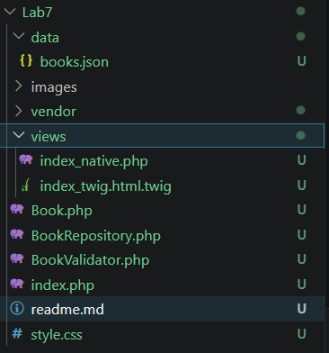
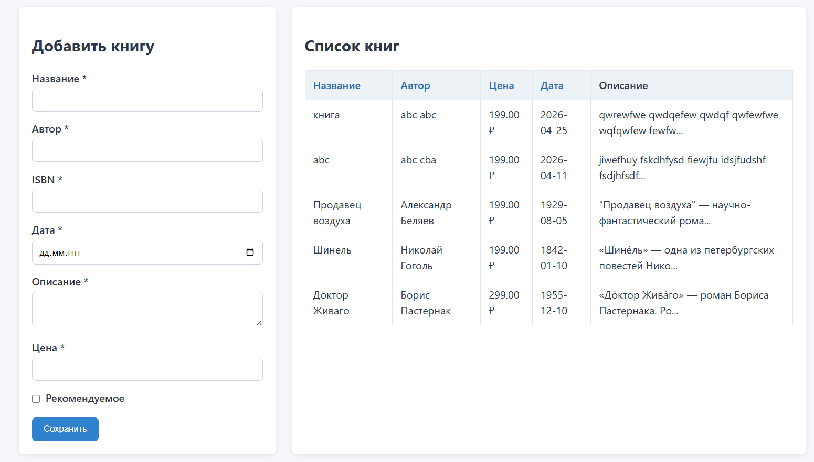
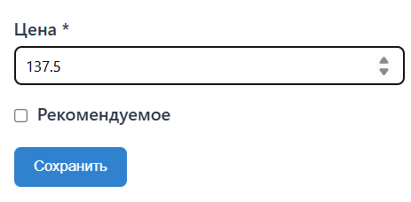
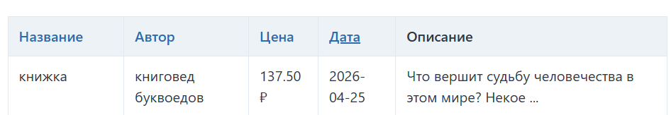

# Лабораторная работа №7. Шаблонизация

## Цель работы

Освоить принципы шаблонизации в PHP, как с использованием нативных PHP-шаблонов, так и с применением готового шаблонизатора. Улучшить структуру проекта, разделив логику обработки данных и представление.

## Условие

Продолжите разработку проекта из лабораторной работы №6, разделив его на слои: логику и представление. Работа выполняется в два этапа - сначала вы реализуете собственный механизм шаблонизации, затем подключаете Twig и реализуете ту же функциональность через него.

## Ход работы

### Шаг 1. Архитектура проекта и разделение слоёв

Проект реорганизован по принципу разделения ответственности, что соответствует паттерну проектирования MVC (Model-View-Controller). Файл `index.php` выполняет роль контроллера: он обрабатывает входящие HTTP-запросы, управляет валидацией данных через класс `BookValidator`, координирует чтение и запись через `BookRepository`, а также подготавливает массив данных для передачи в представление. Шаблоны в папке `views/` отвечают только за отображение, они не содержат бизнес-логики, не работают с файловой системой и не обрабатывают `$_POST`.



Контроллер определяет, какой шаблон использовать, через параметр `?engine=...`. Это архитектурное решение позволяет демонстрировать и нативные PHP шаблоны, и реализацию через Twig параллельно без дублирования логики обработки данных. Переменная `$engine` передаётся в оба шаблона, что обеспечивает корректную работу форм и ссылок сортировки независимо от выбранного режима.

```php
// Выбор шаблонизатора в index.php
$engine = $_GET['engine'] ?? 'php';
$viewData = [
    'books' => $books, 
    'errors' => $errors, 
    'success' => $success,
    'sortField' => $sortField,
    'sortOrder' => $sortOrder,
    'engine' => $engine 
];

if ($engine === 'twig') {
    // Инициализация Twig: загрузчик файлов и окружение
    $loader = new \Twig\Loader\FilesystemLoader(__DIR__ . '/views');
    $twig = new \Twig\Environment($loader, ['cache' => false, 'debug' => true]);
    
    // Регистрация кастомного фильтра
    $twig->addFilter(new \Twig\TwigFilter('format_price', function ($price) {
        return number_format((float)$price, 2, '.', ' ') . ' ₽';
    }));
    
    echo $twig->render('index_twig.html.twig', $viewData);
} else {
    // Нативный PHP: распаковка массива в переменные и подключение шаблона
    extract($viewData);
    include __DIR__ . '/views/index_native.php';
}
```

Важно отметить, что при успешной отправке формы используется редирект с сохранением параметра `engine`: `header('Location: index.php?status=success&engine=' . $engine)`. Это предотвращает потерю контекста, что случалось в ранней реализации проекта.

### Шаг 2. Нативный шаблон на чистом PHP

Шаблон `views/index_native.php` использует стандартный синтаксис PHP для вставки динамических данных. Все переменные, полученные из внешних источников, обязательно экранируются функцией `htmlspecialchars()` перед выводом в HTML. Это крайне важно для предотвращения уязвимостей типа XSS.

```php
<!-- views/index_native.php (фрагмент формы) -->
<form action="?engine=<?= $engine ?>" method="POST">
    <div class="form-group">
        <label for="title">Название книги *</label>
        <!-- Экранирование входных данных для сохранения значения при ошибке валидации -->
        <input type="text" id="title" name="title" required minlength="2" maxlength="150" 
               value="<?= htmlspecialchars($_POST['title'] ?? '') ?>">
    </div>
    
    <div class="form-group">
        <label for="author">Автор *</label>
        <input type="text" id="author" name="author" required minlength="2" maxlength="100"
               value="<?= htmlspecialchars($_POST['author'] ?? '') ?>">
    </div>
    
    <!-- Остальные поля аналогично -->
    
    <button type="submit">Сохранить книгу</button>
</form>
```

При выводе списка книг также применяется экранирование и форматирование:

```php
<!-- views/index_native.php (фрагмент таблицы) -->
<table>
    <thead>
        <tr>
            <!-- Ссылки сортировки сохраняют параметр engine -->
            <th><a href="?sort=title&engine=<?= $engine ?>">Название</a></th>
            <th><a href="?sort=author&engine=<?= $engine ?>">Автор</a></th>
            <th><a href="?sort=price&engine=<?= $engine ?>">Цена</a></th>
        </tr>
    </thead>
    <tbody>
        <?php foreach ($books as $book): ?>
            <tr>
                <td><?= htmlspecialchars($book['title']) ?></td>
                <td><?= htmlspecialchars($book['author']) ?></td>
                <!-- Форматирование цены вручную: число -> строка с валютой -->
                <td><?= number_format((float)$book['price'], 2, '.', ' ') ?> ₽</td>
                <td><?= htmlspecialchars($book['publication_date']) ?></td>
            </tr>
        <?php endforeach; ?>
    </tbody>
</table>
```

**Особенности подхода на чистом PHP:**
- Прямой доступ к переменным после вызова `extract($viewData)`, что упрощает написание шаблонов, но может привести к конфликтам имён переменных в больших проектах;
- Необходимость ручного экранирования каждого вывода: пропуск `htmlspecialchars()` в одном месте создаёт уязвимость;
- Логика форматирования дублируется в каждом месте вывода;
- Отсутствие встроенного кэширования: каждый запрос заново парсит и исполняет PHP-код шаблона.

### Шаг 3. Интеграция Twig и подготовка окружения

Для работы с Twig сначала необходимо было установить пакет через Composer: `composer require twig/twig`. После установки в проекте появляется директория `vendor/` с автозагрузчиком классов, который подключается в начале `index.php` через `require 'vendor/autoload.php'`.

Шаблон `views/index_twig.html.twig` использует специальный синтаксис: `{{ выражение }}` для вывода переменных и `` для управляющих конструкций. Важное отличие от нативного PHP — Twig автоматически экранирует все переменные при выводе, что обеспечивает базовую защиту от XSS без надобности делать это вручную.

```html
<!-- views/index_twig.html.twig (фрагмент формы) -->
<form action="?engine={{ engine }}" method="POST">
    <div class="form-group">
        <label for="title">Название книги *</label>
        <!-- Twig автоматически экранирует вывод, _POST доступен как глобальная переменная -->
        <input type="text" id="title" name="title" required minlength="2" maxlength="150" 
               value="{{ _POST.title ?? '' }}">
    </div>
    
    <div class="form-group">
        <label for="author">Автор *</label>
        <input type="text" id="author" name="author" required minlength="2" maxlength="100"
               value="{{ _POST.author ?? '' }}">
    </div>
    
    <button type="submit">Сохранить книгу</button>
</form>
```

Вывод данных в таблице также становится более лаконичным:

```html
<!-- views/index_twig.html.twig (фрагмент таблицы) -->
<table>
    <thead>
        <tr>
            <!-- Тернарный оператор в синтаксисе Twig для инверсии порядка сортировки -->
            <th><a href="?sort=title&engine={{ engine }}&order={{ sortField == 'title' and sortOrder == 'asc' ? 'desc' : 'asc' }}">Название</a></th>
            <th><a href="?sort=author&engine={{ engine }}&order={{ sortField == 'author' and sortOrder == 'asc' ? 'desc' : 'asc' }}">Автор</a></th>
            <th><a href="?sort=price&engine={{ engine }}&order={{ sortField == 'price' and sortOrder == 'asc' ? 'desc' : 'asc' }}">Цена</a></th>
        </tr>
    </thead>
    <tbody>
        
            <tr>
                <td>{{ book.title }}</td>
                <td>{{ book.author }}</td>
                <!-- Применение кастомного фильтра -->
                <td>{{ book.price | format_price }}</td>
                <td>{{ book.publication_date }}</td>
            </tr>
        
    </tbody>
</table>
```

### Шаг 4. Реализация кастомного фильтра Twig

Одной из ключевых возможностей Twig является система расширений. Для решения практической задачи форматирования цен был создан кастомный фильтр `format_price`. Фильтр регистрируется в окружении Twig до рендеринга шаблона и принимает на вход числовое значение, возвращая отформатированную строку.

```php
// Регистрация фильтра в index.php перед рендерингом
$formatPriceFilter = new \Twig\TwigFilter('format_price', function ($price) {
    
    return number_format((float)$price, 2, '.', ' ') . ' ₽';
});
$twig->addFilter($formatPriceFilter);
```

Лаконичное использование фильтра в шаблоне:

```twig
{{ book.price | format_price }}
```

При значении `1500.5` фильтр вернёт строку `1 500.50 ₽`, что улучшает восприятие цен пользователем. Преимущество такого подхода в том, что логика форматирования инкапсулирована в одном месте: если в будущем потребуется изменить формат (например, добавить пробел перед валютой или изменить количество знаков), достаточно поправить код фильтра, а не искать все места вывода цены в шаблонах.

### Результаты работы кода

**Интерфейсы нативного PHP и Twig визуально практически не отличаются.**



**Работа кастомного фильтра (форматирование цены)**





**Переключение между шаблонизаторами**


## Контрольные вопросы

**1. В чём отличие нативных PHP-шаблонов от шаблонизатора Twig? Какие преимущества и недостатки у каждого подхода?**

**1.1. Отличия**

Нативные PHP-шаблоны используют стандартный синтаксис языка прямо внутри HTML, тогда как Twig применяет собственный изолированный синтаксис, который компилируется в PHP-код.  
Главное отличие: Twig автоматически экранирует все выводимые переменные, обеспечивая защиту от XSS по умолчанию, в то время как в нативном подходе разработчик должен вручную вызывать htmlspecialchars() для каждого вывода.

**1.2. Преимущества и недостатки**

**Нативные шаблоны**  
- Преимущества: низкий порог входа для любого PHP-разработчика, отсутствие внешних зависимостей, полный контроль над выполняемым кодом. 
- Недостатки: высокий риск уязвимостей из-за человеческого фактора, смешивание логики с разметкой усложняет поддержку, отсутствие встроенных механизмов кэширования и наследования шаблонов.

**Twig**  
- Преимущества: автоматическая безопасность, чистый и читаемый синтаксис, система наследования шаблонов, встроенное кэширование скомпилированных файлов и удобное расширение через фильтры и функции. 
- Недостатки: необходимость подключения Composer и изучения нового синтаксиса, зависимость от сторонней библиотеки.

**2. Зачем разделять логику и представление в проекте? Какие проблемы могут возникнуть, если смешивать их в одном файле?**  
Разделение логики и представления упрощает поддержку кода, позволяет команде параллельно работать над интерфейсом и серверной частью. При смешивании PHP и HTML в одном файле возникает трудночитаемый "спагетти-код", где правки в дизайне рискуют сломать бизнес-логику и наоборот. В итоге проект становится сложным для тестирования и масштабирования.

**3. Что такое наследование шаблонов в Twig? Как работают  и ?**  
Наследование шаблонов в Twig — это механизм, позволяющий создать единый базовый макет сайта и переиспользовать его в остальных страницах, переопределяя только изменяемые участки. Директива  указывает родительский шаблон и должна быть самой первой строкой в файле, чтобы Twig знал, от чего отталкиваться при сборке. Тег  в родителе обозначает зону, которую дочерний шаблон может полностью заменить или дополнить, используя такой же  со своим содержимым. Если дочерний шаблон не описывает конкретный блок, Twig автоматически подставит содержимое из родителя.