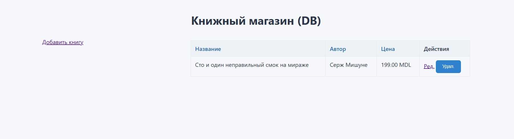
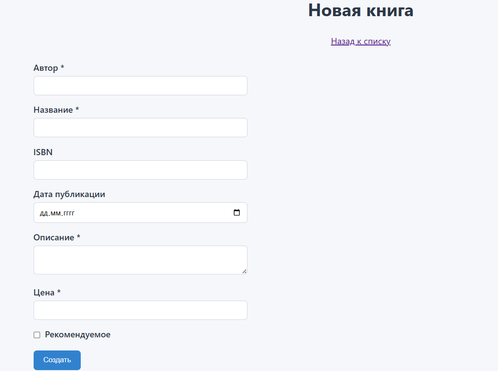
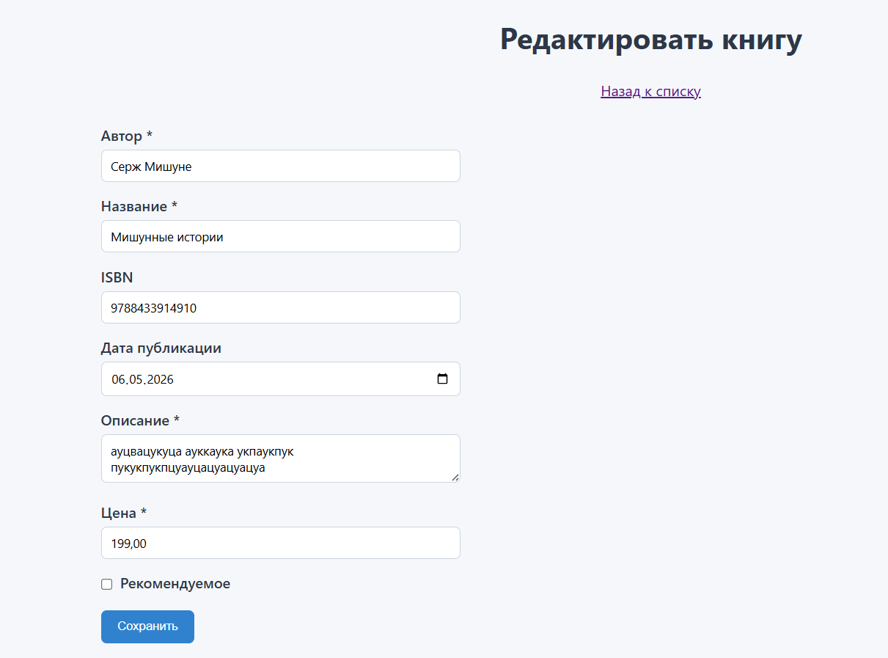

# Лабораторная работа №8. Переход на реляционную базу данных

## Цель работы
Освоить работу с реляционными базами данных в PHP с использованием PDO. Перенести хранение данных из файлов в базу данных, реализовать полный цикл операций CRUD: создание, чтение, обновление и удаление записей.

## Условие
Продолжите разработку проекта из лабораторной работы №7. Замените хранение данных в файле data.json на реляционную базу данных.

## Ход работы

### Шаг 1. Проектирование базы данных
Для хранения данных создана база данных `bookstore_lab8` в СУБД PostgreSQL. Реализована схема из двух таблиц со связью **«Один ко многим»**: один автор может написать множество книг, но каждая книга принадлежит только одному автору.

**Структура таблиц:**

1.  **`authors`** (Авторы):
    *   `id` (SERIAL PRIMARY KEY) — уникальный идентификатор.
    *   `name` (VARCHAR) — имя автора.
    *   `created_at` (TIMESTAMP) — дата создания записи.

2.  **`books`** (Книги):
    *   `id` (SERIAL PRIMARY KEY) — уникальный идентификатор.
    *   `author_id` (INT) — внешний ключ, ссылается на `authors.id`.
    *   `title`, `isbn`, `publication_date`, `description`, `price` — атрибуты книги.
    *   `is_featured` (SMALLINT) — флаг рекомендации.

Использование типа `SERIAL` в PostgreSQL автоматически создает последовательность для генерации уникальных ID, что заменяет `AUTO_INCREMENT` из MySQL.

```sql
CREATE TABLE authors (
    id SERIAL PRIMARY KEY,
    name VARCHAR(100) NOT NULL UNIQUE
);

CREATE TABLE books (
    id SERIAL PRIMARY KEY,
    author_id INT NOT NULL REFERENCES authors(id) ON DELETE CASCADE,
    title VARCHAR(255) NOT NULL,
    price DECIMAL(10, 2) DEFAULT 0.00,
    -- остальные поля...
);
```

### Шаг 2. Подключение к базе данных
Подключение инкапсулировано в класс `Database` (`src/Database.php`). Используется драйвер PDO с настройками безопасности:
*   `PDO::ATTR_ERRMODE => PDO::ERRMODE_EXCEPTION`: ошибки БД выбрасывают исключения.
*   `PDO::ATTR_EMULATE_PREPARES => false`: использование нативных подготовленных выражений PostgreSQL для максимальной защиты.

Конфигурация доступа (хост, логин, пароль) вынесена в отдельный файл `config.php` для удобства развертывания.

```php
class Database {
    public static function getConnection(): PDO {
        // ... инициализация DSN для pgsql ...
        return new PDO($dsn, $user, $pass, [
            PDO::ATTR_ERRMODE => PDO::ERRMODE_EXCEPTION,
            PDO::ATTR_EMULATE_PREPARES => false
        ]);
    }
}
```

### Шаг 3. Реализация CRUD-операций
Вся логика работы с данными вынесена в процедурные функции файла `src/functions.php`. Это соответствует требованию разделения логики и упрощает поддержку.

#### Ключевые функции:
1.  **`createRecord(array $data)`**: Добавляет книгу. Перед вставкой вызывает вспомогательную функцию `getOrCreateAuthor()`, которая проверяет наличие автора по имени и создает нового, если он отсутствует. Операция обернута в транзакцию (`beginTransaction`/`commit`), чтобы гарантировать целостность данных (если книга добавилась, а автор нет — всё откатится).
2.  **`getAllRecords()`**: Возвращает список всех книг с именем автора через `JOIN`. Поддерживает динамическую сортировку по безопасному белому списку полей.
3.  **`updateRecord(int $id, array $data)`**: Обновляет данные книги и привязанного автора.
4.  **`deleteRecord(int $id)`**: Удаляет книгу по ID. В PostgreSQL конструкция `LIMIT` в запросе `DELETE` запрещена, поэтому используется строгая фильтрация по первичному ключу.

#### Безопасность (SQL-инъекции):
Все пользовательские данные передаются в SQL-запросы исключительно через **подготовленные выражения** (placeholders `:name`). Это полностью исключает возможность внедрения вредоносного SQL-кода.

```php
// Пример безопасной вставки
$stmt = $pdo->prepare("INSERT INTO books (title, price) VALUES (:title, :price)");
$stmt->execute([':title' => $data['title'], ':price' => $data['price']]);
```

### Шаг 4. Валидация данных
Функция `validateBookData()` реализует серверную проверку входных данных перед отправкой в БД:
*   Проверка обязательности полей.
*   Запрет цифр в именах авторов и названиях книг (бизнес-логика).
*   Проверка формата ISBN и даты публикации.
*   Контроль минимальной длины описания и корректности цены.

### Шаг 5. Интерфейс и безопасность форм
Интерфейс реализован с использованием шаблонизатора Twig.

**CSRF-защита:**
Для защиты от межсайтовой подделки запроса (CSRF) в каждой форме (создание, редактирование, удаление) присутствует скрытое поле с токеном. Токен генерируется в сессии пользователя и сверяется на сервере при обработке POST-запроса.

**Удаление записей:**
Удаление выполняется строго через метод `POST` с подтверждением действия. GET-запросы не могут удалить данные, что предотвращает случайное или злонамеренное удаление через ссылки.

### Результаты работы кода

**Главная страница со списком книг (PostgreSQL)**



**Форма добавления книги с валидацией**



**Редактирование информации о книге**



## Контрольные вопросы

**1. Что такое PDO и чем он отличается от устаревших расширений mysqli_*?**  
PDO (PHP Data Objects) - это универсальный интерфейс доступа к базам данных, поддерживающий множество драйверов СУБД, что обеспечивает переносимость кода. В отличие от `mysqli`, который работает только с MySQL, PDO использует объектно-ориентированный подход по умолчанию и предоставляет единообразный API для разных СУБД.

**2. Что такое подготовленные выражения и зачем они нужны? Как они защищают от SQL-инъекций?**  
Подготовленные выражения - это механизм, при котором шаблон SQL-запроса компилируется базой данных отдельно от передаваемых параметров. Они защищают от SQL-инъекций, так как пользовательские данные никогда не интерпретируются как часть SQL-команды: СУБД воспринимает их строго как значения переменных, исключая возможность внедрения вредоносного кода.

**3. Что такое транзакция в базе данных? В каких ситуациях её стоит использовать?**  
Транзакция - это последовательность операций с БД, которая выполняется как единое целое: либо все изменения успешно сохраняются, либо все отменяются при ошибке. Её следует использовать в ситуациях, требующих атомарности данных, например, при переводе денег между счетами или создании связанных записей в нескольких таблицах (как книга и автор в этой работе).

**4. Чем отличается fetch() от fetchAll() в PDO?**  
Метод `fetch()` возвращает одну следующую строку из результата запроса в виде массива или объекта, что экономит память при обработке больших выборок построчно. Метод `fetchAll()` загружает сразу все строки результата в один многомерный массив, что удобно для небольших наборов данных, но может привести к переполнению памяти при больших объемах.